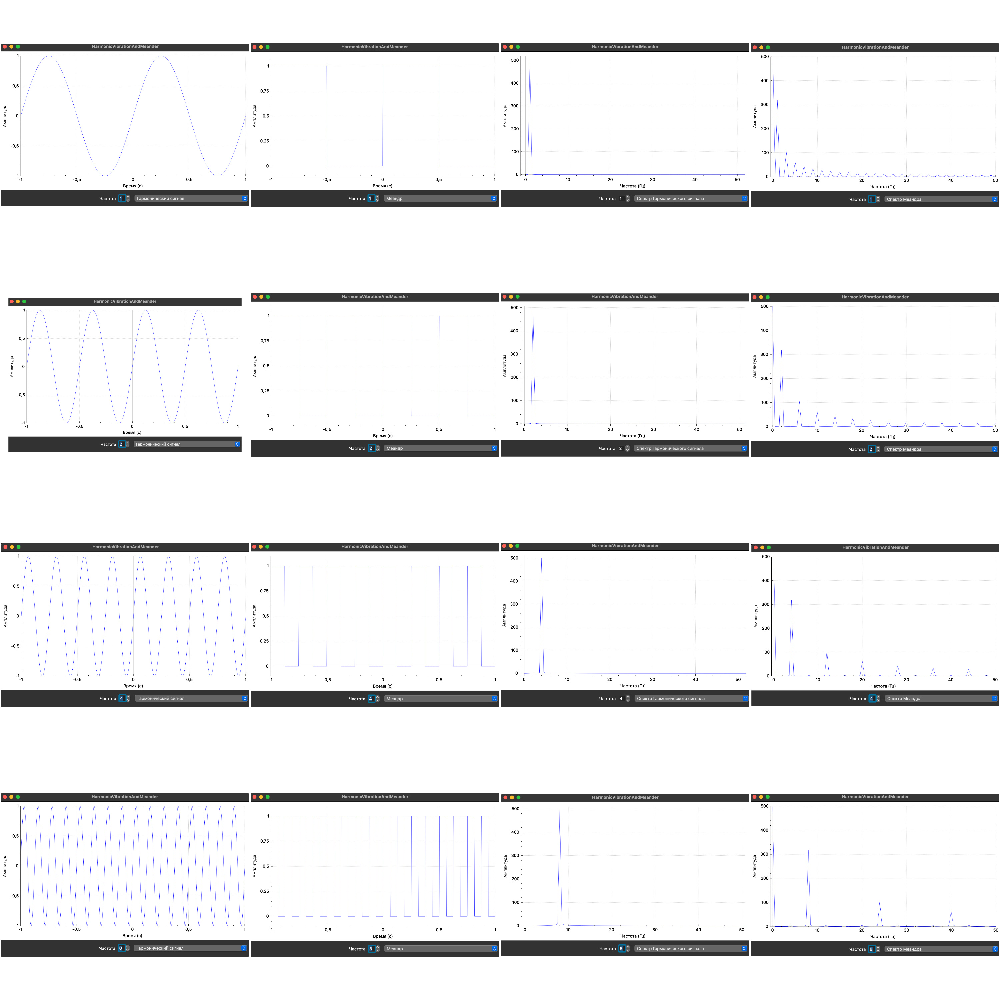

# ТИПиС Лабораторная работа №1

## Зависимости
CMake - минимальная версия 3.29.
FFTW - библиотека для получения спектра с помощью быстрого преобразования фурье, скачивается автоматически.
Qt6 - необходимо установить вручную.

на Линуксе:
````bash
    sudo apt install qt6-base-dev qt6-base-dev-tools
````
На мак ос:
````bash
    brew install qt6
````

На Windows:
````bash
vcpkg install qt
````
или только базовый пакет

````bash
vcpkg install qtbase
````

## Сборка
Создайте директорию билда и перейдите в нее
````bash
mkdir build && cd build
````
Далее необходимо собрать fftw
````bash
cmake --build . --target project_fftw
````
После чего сборка основного проекта
````bash
cmake --build .
````
После успешной сборки можно запустить приложение
````bash
./TIP_S
````

Ссылка на github репозиторий
https://github.com/menshikovnik/TIP_S

Картинка с графиками в корне репозитория


